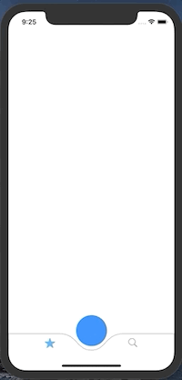

# CustomTabBar

## About

This project was built to understand how to make a custom tab bar using UIKit. Using BezierPaths I was able to create a unique interface with button inbetween the 2 tabs. 

## Code Snippets:

### Creating the shape of the tab bat using BezierPaths
```swift
    func createPath() -> CGPath {
        
        let height: CGFloat = 37.0
        let path = UIBezierPath()
        let centerWidth = self.frame.width / 2
        
        path.move(to: CGPoint(x: 0, y: 0)) // start top left of frame
        path.addLine(to: CGPoint(x: (centerWidth - height * 2), y: 0))
        // first curve down
        path.addCurve(to: CGPoint(x: centerWidth, y: height), controlPoint1: CGPoint(x: (centerWidth - 30), y: 0), controlPoint2: CGPoint(x: (centerWidth - 35), y: height))
        // second curve up
        path.addCurve(to: CGPoint(x: (centerWidth + height * 2), y: 0), controlPoint1: CGPoint(x: (centerWidth + 35), y: height), controlPoint2: CGPoint(x: (centerWidth + 30), y: 0))
        
        // complete rect
        path.addLine(to: CGPoint(x: self.frame.width, y: 0))
        path.addLine(to: CGPoint(x: self.frame.width, y: self.frame.height))
        path.addLine(to: CGPoint(x: 0, y: self.frame.height))
        path.close()
        
        return path.cgPath
    }
```

### Adding animations to our tab bar icons:

Pretty self explanitory within the code. Using an enum I gave my TabBar items tags, allowing me to switch on them within the didSelect function. There my animate function is called once the tabbar item is selected. Using unique tags also allows for unique calls for each item. For example you can make 2 different animations for each item you have in your TabBar. 

``` swift
enum TabbarItemTag: Int {
    case firstViewController = 101
    case secondViewConroller = 102
}

class CustomTabBarController: UITabBarController {
    var firstTabbarItemImageView: UIImageView!
    var secondTabbarItemImageView: UIImageView!

    override func viewDidLoad() {
        super.viewDidLoad()

        let firstItemView = tabBar.subviews.first!
        firstTabbarItemImageView = firstItemView.subviews.first as? UIImageView
        firstTabbarItemImageView.contentMode = .center

        let secondItemView = self.tabBar.subviews[1]
        self.secondTabbarItemImageView = secondItemView.subviews.first as? UIImageView
        self.secondTabbarItemImageView.contentMode = .center
    }

    private func animate(_ imageView: UIImageView) {
        UIView.animate(withDuration: 0.1, animations: {
            imageView.transform = CGAffineTransform(scaleX: 0.75, y: 0.75)
            self.firstTabbarItemImageView.image = UIImage(systemName: "star")
        }) { _ in
            UIView.animate(withDuration: 0.25, delay: 0.0, usingSpringWithDamping: 0.5, initialSpringVelocity: 3.0, options: .curveEaseInOut, animations: {
                imageView.transform = CGAffineTransform(scaleX: 1.0, y: 1.0)
            }, completion: nil)
        }
    }

    override func tabBar(_ tabBar: UITabBar, didSelect item: UITabBarItem) {
        guard let tabbarItemTag = TabbarItemTag(rawValue: item.tag) else {
            return
        }

        switch tabbarItemTag {
        case .firstViewController:
            animate(firstTabbarItemImageView)
        case .secondViewConroller:
            animate(secondTabbarItemImageView)
        }
    }
}
```

[
